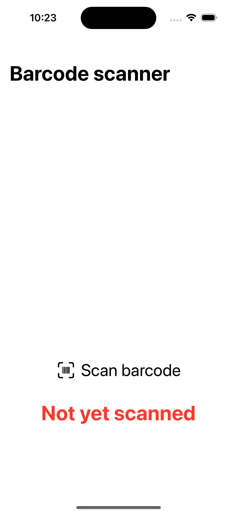
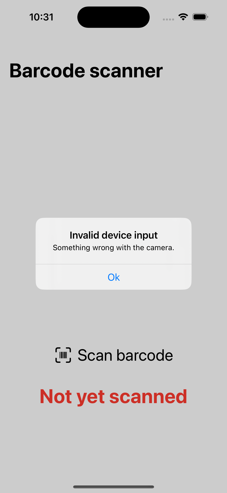

# Barcode scanner
## Introduction
This is my third SwiftUI project. Here I'm learning to develope and manage States, Bindings, UIKit and alerts.

This app scans EAN-8 and EAN-13 barcode through the phone camera.

I'm studying SwiftUI thanks to this [video.](https://youtu.be/b1oC7sLIgpI?si=rbQqJavLBTJpxdya)
## Previews

